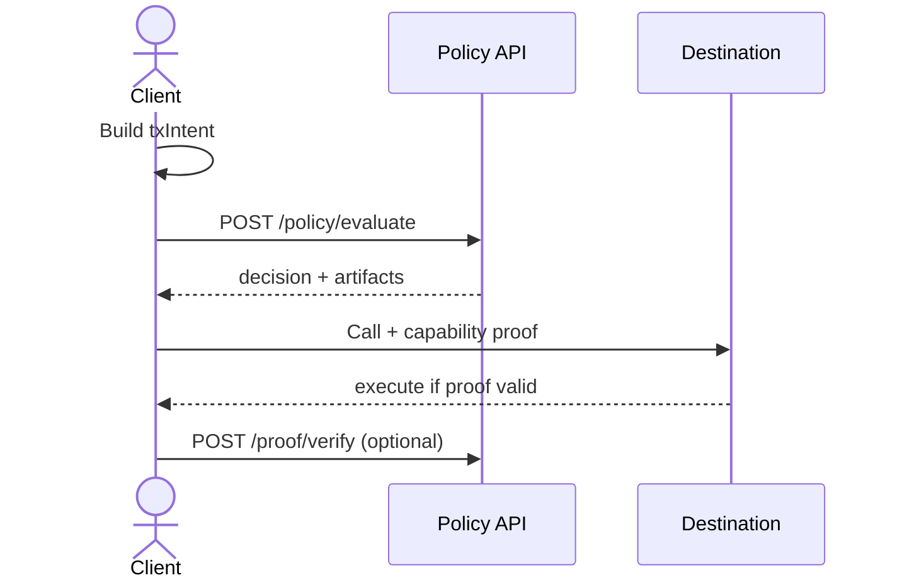

# Architecture

Canopy turns a transaction intent into a short-lived capability bound to a specific on-chain call.

## Flow

1. Build `txIntent` (`chainId`, `subject`, `target`, `value`, `selector`, `args`, `policyId`).
2. `POST /policy/evaluate` → `{ decision, artifacts: { callHash, expiry, nonce, capabilitySig } }`.
3. Attach proof to the on-chain call; the destination/validator verifies (or preflight via `POST /proof/verify`).



## Endpoints

- `GET /health/ping`
- `POST /policy/evaluate`
- `POST /capability/issue`
- `POST /proof/verify`

## Call binding

```
callHash = keccak256(abi.encode(
  chainid, target, subject, selector, value, keccak256(args)
))
```

## Capability (EIP-712)

Domain: `{ name:"Canopy", version:"1", chainId, verifyingContract: verifier }`

Type: `CompliantCall(subject, verifier, target, value, argsHash, policyId, expiry, nonce)`

## Safety

- Short TTL (e.g., 60s), single-use nonce, issuer allowlist.
- Normalize inputs: checksummed `0x` addresses, 4-byte selector, raw args (no selector).
